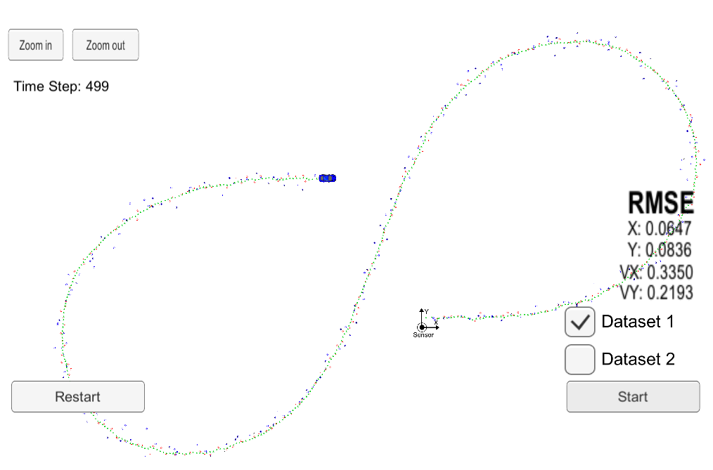
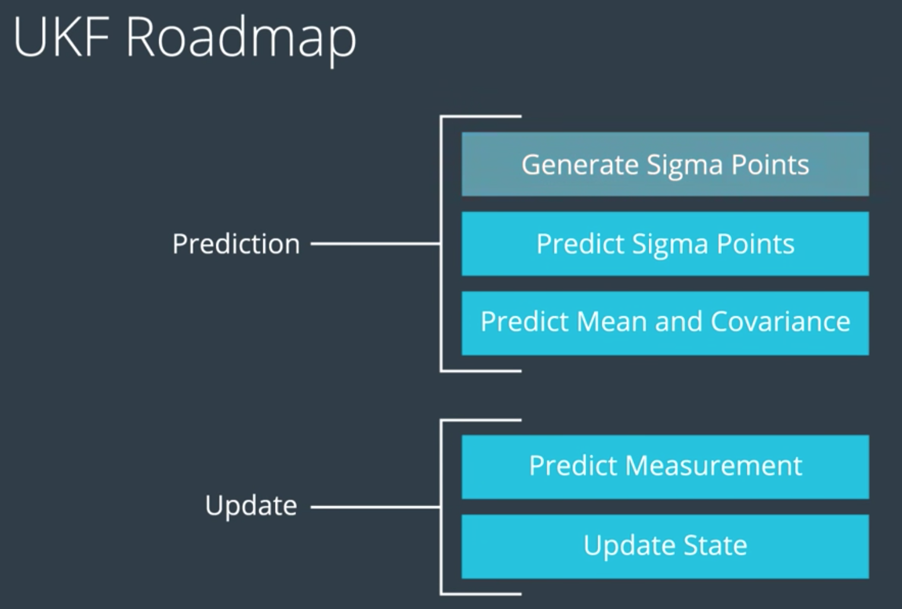
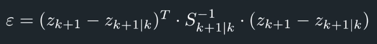
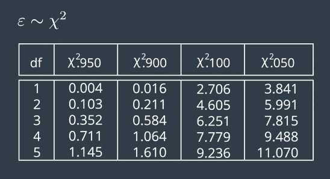

# Object Tracking using Lidar and Radar sensor data - Unscented Kalman Filter
Self-Driving Car Engineer Nanodegree Program

## Goal of this project
Uilize a Kalman filter to estimate the state of a moving object of interest with noisy lidar and radar measurements.
The goal is to obatin low RMSE values for the estimated parameters: position in the x and y axis, and velocity in the x and y axis.

## Data
This project involves the Term 2 Simulator from Udacity which can be downloaded [here](https://github.com/udacity/self-driving-car-sim/releases)
Data is read from and to the Simulator by the C++ program. See file `main.cpp`

## Reading data from the Simulator:
This repository includes two files that can be used to set up and install [uWebSocketIO](https://github.com/uWebSockets/uWebSockets) for either Linux or Mac systems. For windows you can use either Docker, VMware, or even [Windows 10 Bash on Ubuntu](https://www.howtogeek.com/249966/how-to-install-and-use-the-linux-bash-shell-on-windows-10/) to install uWebSocketIO. Please see [this concept in the classroom](https://classroom.udacity.com/nanodegrees/nd013/parts/40f38239-66b6-46ec-ae68-03afd8a601c8/modules/0949fca6-b379-42af-a919-ee50aa304e6a/lessons/f758c44c-5e40-4e01-93b5-1a82aa4e044f/concepts/16cf4a78-4fc7-49e1-8621-3450ca938b77) for the required version and installation scripts.

## Run the project
Once the install for uWebSocketIO is complete, the main program can be built and run by doing the following from the project top directory.

    1. mkdir build && cd build
    2. cmake .. && make
    3. ./UnscentedKF

Then open the simulator and click on start.

## Results

### Final RMSE Values:

        rmse_x:  0.0647
        rmse_y:  0.0836
        rmse_vx: 0.3350
        rmse_vx: 0.2193
        
 

## Workflow



### Basic Idea

The Unscented Kalman Filter solves the problem of finding the best approximation for a Normal Distribution using Sigma Points.
Sigma Points serve as a representation of the whole distribution and we chose them aroung the mean state and in a certain relation to the standard deviation of every state dimention.
After having calcuated the sigma points, we just project them one by one through the non linear function f.

### Prediction Steps
1. **Generate Sigma Points:** we generate an _"augmented"_ mean vector x and covariance P in order to take into consideration the process noise.
`See file src/ukf.cpp from line 159 to line 187`

2. **Predict Sigma Points:** We simply insert evert sigma point into the process model.
`See file src/ukf.cpp from line 196 to line 237`

3. **Predict Mean and Covariance Matrix**: This is where the prediction procedure ends: we need to use the predicted sigma points to calculate the mean and covariance of the predicted state. It is important to notice the use of the weights for each sigma point: because we used lambda before to set how much we want to spread the sigma points, now we need to consider weigh the prediction according to the spread. `See file src/ukf.cpp from line 247 to line 261`

### Update Steps
1. **Predict Measurement:**
    
    * **Transform sigma points into measurement space** 
        * Radar: `See file src/ukf.cpp from line 319 to line 341`
        * Lidar: `See file src/ukf.cpp from line 280 to line 290`
    * **Set Measurement Noise Covariance Matrix**
        * Radar: `See file src/ukf.cpp from line 343 to line 346`
        * Lidar: `See file src/ukf.cpp from line 292 to line 294`
    * **Create vector for incoming radar measurement**
        * Radar: `See file src/ukf.cpp from line 348 to line 352`
        * Lidar: `See file src/ukf.cpp from line 296 to line 299`
    * **Inizialize:** Mean predicted z vector, Measurement Covariance Matrix S and Cross Correlation Matrix Tc. `See file src/ukf.cpp from line 359 to line 385`

2. **Update:**
    
    `See file src/ukf.cpp from line 393 to line 430`
    * Calcualate Cross Correlation Matrix.
    * Calculate Kalman Gain
    * Update state mean and covariance matrix
    
## Check Consistency
 
### Basic idea
We want to know id we set up the noise parameters correctly. At every tie cyce we calcualte the measurement prediction and the Covariane Matrix S. Then we receive the actual measurement.
We need to make sure that the filter is consistent and provides realistic estimation uncertainty.

### How
We use the **Normalized Innovation Squared**: The Innovation is the difference between the predicted measurement and the actual measurement. We normalize it by putting it into relation to the Covariance Matrix S.

 

### Chi Squared Distribution
NIS follows the Chi Squared Distribution. By using the table below we can make sure that our NIS values are not too high. For example, for Radar measurements we have 3 dimensions - degrees of freedom - therefore the probability of having values above 7.815 is below 5%.

 

### Where in the code and how:
Nis values are calcualated here `See file src/ukf.cpp from line 432 to line 434`.
The maximum values with which we want to compare our NIS with are defined at `See file src/ukf.h from line 74 to line 75`.
From file `src/ukf.cpp at line 135` we print whether the NIS values are lower or higher than the maximum values.

```C++
std::cout<<"NIS_Lidar OK?: "<<BoolToString(!(NIS_Lidar > chi_squared_2D))<<std::endl;
std::cout<<"NIS_Radar OK?: "<<BoolToString(!(NIS_Radar > chi_squared_3D))<<std::endl;
 ```
